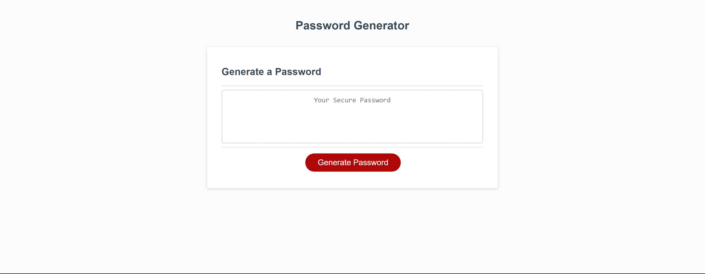

## Password-Generator
A password generator that generates simple to complex passwords.

## Usage
Select which type of characters to generate, as well as the number of characters in the prompt that appears after clicking "Generate Password".

## Screenshots

## Sources

AskBCS

Dylan Osborn - Classmate

ChatGPT

W3Schools.com

SlackOverflow.com

